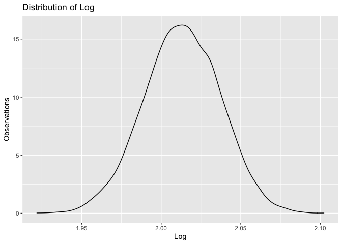

p8105\_hw6\_kz2411
================
Keming Zhang
11/29/2021

## Problem 1

``` r
#load data
child_data <- read_csv('data/birthweight.csv') %>%
  janitor::clean_names()
```

    ## Rows: 4342 Columns: 20

    ## ── Column specification ────────────────────────────────────────────────────────
    ## Delimiter: ","
    ## dbl (20): babysex, bhead, blength, bwt, delwt, fincome, frace, gaweeks, malf...

    ## 
    ## ℹ Use `spec()` to retrieve the full column specification for this data.
    ## ℹ Specify the column types or set `show_col_types = FALSE` to quiet this message.

``` r
#check missing
miss_var_summary(child_data) %>% knitr::kable(digits = 3)
```

| variable | n\_miss | pct\_miss |
|:---------|--------:|----------:|
| babysex  |       0 |         0 |
| bhead    |       0 |         0 |
| blength  |       0 |         0 |
| bwt      |       0 |         0 |
| delwt    |       0 |         0 |
| fincome  |       0 |         0 |
| frace    |       0 |         0 |
| gaweeks  |       0 |         0 |
| malform  |       0 |         0 |
| menarche |       0 |         0 |
| mheight  |       0 |         0 |
| momage   |       0 |         0 |
| mrace    |       0 |         0 |
| parity   |       0 |         0 |
| pnumlbw  |       0 |         0 |
| pnumsga  |       0 |         0 |
| ppbmi    |       0 |         0 |
| ppwt     |       0 |         0 |
| smoken   |       0 |         0 |
| wtgain   |       0 |         0 |

There is no missing.

``` r
#convert numeric to factor where appropriate
child_data_clean <- child_data %>%
  mutate(
    babysex = factor(babysex),
    frace = factor(frace),
    malform = factor(malform),
    mrace = factor(mrace)
  )

#check type
head(child_data_clean,0)
```

    ## # A tibble: 0 × 20
    ## # … with 20 variables: babysex <fct>, bhead <dbl>, blength <dbl>, bwt <dbl>,
    ## #   delwt <dbl>, fincome <dbl>, frace <fct>, gaweeks <dbl>, malform <fct>,
    ## #   menarche <dbl>, mheight <dbl>, momage <dbl>, mrace <fct>, parity <dbl>,
    ## #   pnumlbw <dbl>, pnumsga <dbl>, ppbmi <dbl>, ppwt <dbl>, smoken <dbl>,
    ## #   wtgain <dbl>

``` r
#fit
fit = lm(bwt ~ babysex + fincome + gaweeks + momage + 
           mrace + frace +  parity + smoken + ppwt, data = child_data_clean)
```

The factors I choose in this model is according to the paper and blog
online
(<https://www.marsden-weighing.co.uk/blog/factors-affect-baby-birth-weight>).
According to the information online, the birth weight is influenced by
genetics, age of the parent, number of babies, mother’s birth weight,
diet, gender, parent’s medical conditions and ethnicity. Therefore, I
choose matched factors available in the data.

``` r
#residual and prediction data
residual <- add_residuals(child_data_clean,fit)
prediction <- add_predictions(child_data_clean, fit)
pred_resid <- residual %>%
  mutate(
    pred = pull(prediction,pred)
  )

#plot
ggplot(pred_resid, aes(x = pred, y = resid)) + 
  geom_point() +
  labs(
    x = "Prediction (g)",
    y = "Residuals (g)",
    title = "Residuals against fitted values"
  )
```

<!-- -->

``` r
#fix random
set.seed(1)

#cross validation split data
cv_df <- crossv_mc(child_data_clean, n = 100) %>% 
  mutate(
    train = map(train, as_tibble),
    test = map(test, as_tibble)
  )

#cross validation result
cv_result <- cv_df %>% 
  mutate(
    my_model  = map(train, ~lm(bwt ~ babysex + fincome + gaweeks +
                                 momage + mrace + frace +  parity + smoken + ppwt, data = .x)),
    fit_model_1 = map(train, ~lm(bwt ~ blength + gaweeks, data = .x)),
    fit_model_2  = map(train, ~lm(bwt ~ bhead + blength + babysex + 
                                    bhead * blength + bhead * babysex + blength * babysex + 
                                    bhead * blength * babysex, data = .x))
  ) %>% 
  mutate(
    rmse_my = map2_dbl(my_model, test, ~rmse(model = .x, data = .y)),
    rmse_model_1    = map2_dbl(fit_model_1, test, ~rmse(model = .x, data = .y)),
    rmse_model_2 = map2_dbl(fit_model_2, test, ~rmse(model = .x, data = .y))
  )
```

    ## Warning in predict.lm(model, data): prediction from a rank-deficient fit may be
    ## misleading

``` r
#plot
cv_result %>% 
  select(starts_with("rmse")) %>% 
  pivot_longer(
    everything(),
    names_to = "model", 
    values_to = "rmse",
    names_prefix = "rmse_") %>% 
  mutate(model = fct_inorder(model)) %>% 
  ggplot(aes(x = model, y = rmse)) + geom_violin() + 
  labs(
    title = "Distribution of RMSE of each model",
    x = "Model",
    y = "RMSE"
  ) +
  scale_x_discrete(labels = c("My model","Model 1","Model 2"))
```

<!-- -->

According to the plot, the error of my model is the biggest and the
model 2 which includes interaction has the smallest error.

## Problem 2

``` r
#load data
weather_df = 
  rnoaa::meteo_pull_monitors(
    c("USW00094728"),
    var = c("PRCP", "TMIN", "TMAX"), 
    date_min = "2017-01-01",
    date_max = "2017-12-31") %>%
  mutate(
    name = recode(id, USW00094728 = "CentralPark_NY"),
    tmin = tmin / 10,
    tmax = tmax / 10) %>%
  select(name, id, everything())
```

    ## Registered S3 method overwritten by 'hoardr':
    ##   method           from
    ##   print.cache_info httr

    ## using cached file: ~/Library/Caches/R/noaa_ghcnd/USW00094728.dly

    ## date created (size, mb): 2021-11-30 16:07:35 (7.614)

    ## file min/max dates: 1869-01-01 / 2021-11-30

``` r
#fix random
set.seed(1)

#bootstrapping
bootstraps <- weather_df %>%
  modelr::bootstrap(n = 5000)

bootstrap_result <- bootstraps %>%
  mutate(
    models = map(strap, ~lm(tmax ~ tmin , data = .x) ),
    summary_model = map(models, broom::glance),
    results = map(models, broom::tidy)
  ) %>%
  select(-strap,-models)
```

``` r
#calculate estimate
r2 <- bootstrap_result %>%
  unnest(summary_model)

log_beta <- bootstrap_result %>%
  unnest(results) %>%
  select(.id,term, estimate) %>%
  pivot_wider(
    names_from = term,
    values_from = estimate
  ) %>%
  select(id = .id, beta_0 = '(Intercept)', beta_1 = tmin) %>%
  mutate(
    log = log(beta_0 * beta_1)
  )
```

``` r
#plot
#r2
r2_distribution <- r2 %>%
  ggplot(aes(x = r.squared)) +
  geom_density() +
  labs(
    title = "Distribution of R Square",
    x = "r Square",
    y = "Observations"
  )

r2_distribution
```

<!-- -->

``` r
#log of multiple of beta 0 and beta 1
log_distribution <- log_beta %>%
  ggplot(aes(x = log)) +
  geom_density() +
  labs(
    title = "Distribution of Log",
    x = "Log",
    y = "Observations"
  )

log_distribution
```

<!-- -->

The distribution of *r̂*<sup>2</sup> is normally distributed. The
distribution of *l**o**g*(*β̂*<sub>0</sub>*β̂*<sub>1</sub>) is also
normally distributed.

``` r
#95% confidence interval of R^2
r2_conf <- r2 %>%
  summarize(
    r2_lower = quantile(r.squared,0.025),
    r2_upper = quantile(r.squared,0.975)
  )
  
r2_conf %>% knitr::kable(digits = 3)
```

| r2\_lower | r2\_upper |
|----------:|----------:|
|     0.894 |     0.927 |

The 95% confidence interval of *r̂*<sup>2</sup> is \[0.894,0.927\]

``` r
#95% confidence interval of log
log_conf <- log_beta %>%
  summarize(
    log_lower = quantile(log, 0.025),
    log_upper = quantile(log, 0.975)
  )

log_conf %>% knitr::kable(digits = 3)
```

| log\_lower | log\_upper |
|-----------:|-----------:|
|      1.965 |      2.059 |

The 95% confidence interval of *l**o**g*(*β̂*<sub>0</sub>*β̂*<sub>1</sub>)
is \[1.964,2.059\]
